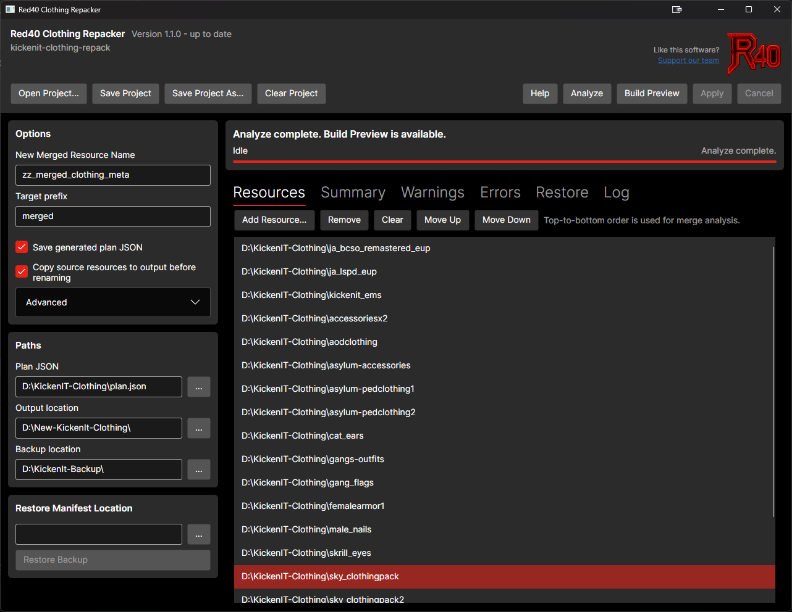
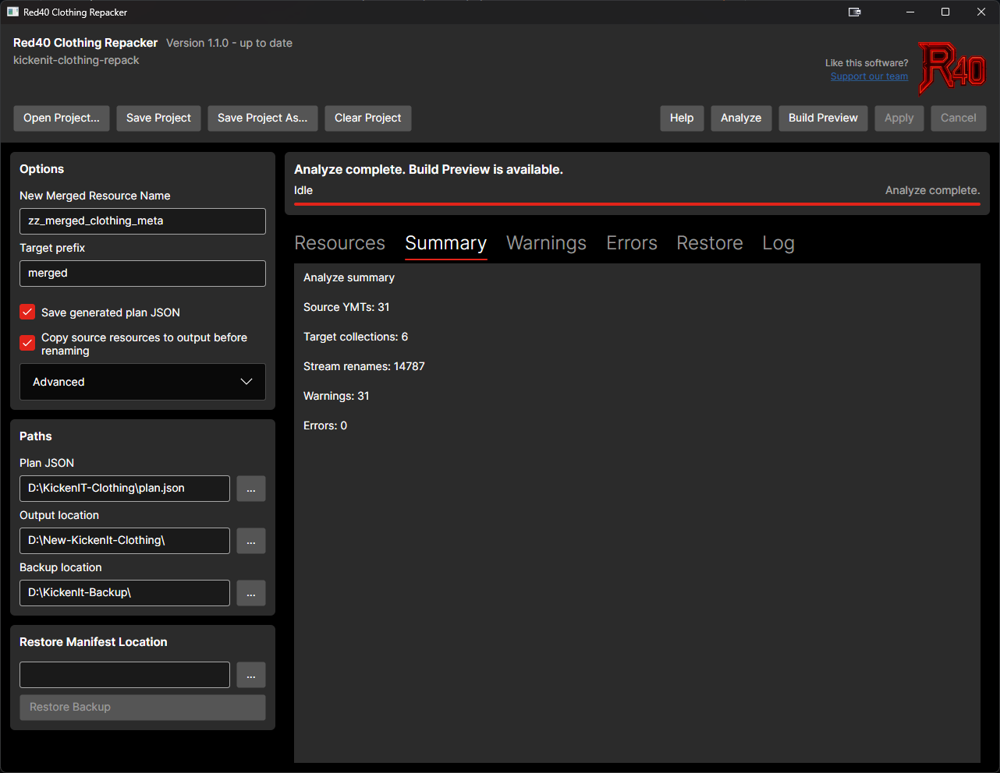
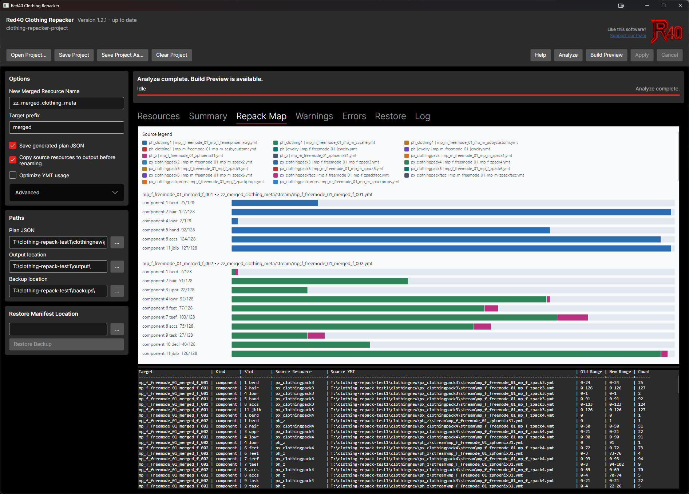

# Red40 Clothing Repacker

`Red40 Clothing Repacker` is a .NET CLI for analyzing GTA V/FiveM clothing resources, merging ped variation collections into a generated resource, and optionally applying those changes back to your working resource set with a reversible backup manifest.

It supports:

- Scanning resource folders for `.ymt` and `.ymt.xml` clothing data
- Exporting binary `.ymt` files to XML for inspection
- Generating a merge plan as JSON
- Building a new merged resource without touching the originals
- Applying the plan to your resources with backup metadata
- Restoring everything from the backup manifest

# [**Red40 Development**](https://red40.dev/scripts)
Like this tool and want to support further development? Checkout our store [Red40 Development](https://red40.dev/scripts)

# NEW COMPONENT LIMIT PER YMT
As of [this commit](https://github.com/citizenfx/fivem/commit/a6f68afb776e6df44a56816efecfef46fdceb36f) the limit per component for YMTs has been increased to 255. You can increase it in the advanced section of the gui or via the cli option documented below. I won't change this default for a little while in case the change is reverted.

## New GUI now available

- Download the [release version](https://github.com/Red40-Development/red40_clothing_packer/releases/latest) approriate for your architecture (Windows/Linux x86-64 builds)

- Launch and follow the steps in the help button
- Enable `Optimize YMT usage` before Analyze if you want the planner to rearrange component/prop lanes across generated YMTs to reduce the target collection count. Leave it off to keep source packs grouped more conservatively. Note that if you have a large number of a single component such as JBIB this will tend to leave ymts with little to no other items in them.

- Now featuring a graphical representation of the repacked ymts







## CLI directions

## Download and Install

### Option 1: Download built binaries

Download the [release version](https://github.com/Red40-Development/red40_clothing_packer/releases/latest) approriate for your architecture (Windows/Linux x86-64 builds)

Copy the executable to your clothing folder

### Option 2: Clone and run from source

Prerequisites:

- Git
- .NET 10 SDK

Clone the repository with the CodeWalker submodule:

```bash
git clone --recurse-submodules https://github.com/Red40-Development/red40_clothing_packer.git
cd red40_clothing_packer
```

Run the CLI directly:

```bash
dotnet run --project src/ClothingRepacker.Cli -- --help
```
### Command Summary

If you are running from source, use `dotnet run --project src/ClothingRepacker.Cli -- ...` instead.

```bash
ClothingRepacker.Cli analyze --resources <path> --target-resource <name> --out <plan.json>
  [--max-drawables-per-component <256>] [--max-drawables-per-prop <256>]
  [--optimize-ymt-usage]
ClothingRepacker.Cli analyze --resource <path_to_resource> [--resource <path_to_resource> ...]
  --generated-root <folder> --target-resource <name> --out <plan.json>
  [--max-drawables-per-component <256>] [--max-drawables-per-prop <256>]
  [--optimize-ymt-usage]

ClothingRepacker.Cli build --plan <plan.json> --out <folder>
  [--include-ymt-xml <true|false>] [--include-debug-client <true|false>]
ClothingRepacker.Cli apply --plan <plan.json> --backup-root <folder> [--copy-resources-to-output]
ClothingRepacker.Cli restore --backup-manifest <backup-manifest.json>
ClothingRepacker.Cli validate --plan <plan.json>
ClothingRepacker.Cli validate --resources <path>
ClothingRepacker.Cli validate --resource <path_to_resource> [--resource <path_to_resource> ...] --generated-root <folder>
ClothingRepacker.Cli report --plan <plan.json> [--out <report.txt>]
ClothingRepacker.Cli export-xml --folder <path> [--overwrite]
```

By default, the CLI checks the latest GitHub release when a command starts and prints a notice if a newer version is available. Add `--no-version-check` to any command, or set `RED40_NO_VERSION_CHECK=1`, to skip the check.

## Reproducible releases

Release publishing enables deterministic .NET compilation, deterministic source paths, and CI build metadata. The release workflow also publishes every target twice and compares SHA-256 hashes for all generated files. A mismatch fails the workflow before the release assets are collected.

To run the same check locally after restoring the solution, use:

```sh
python3 scripts/verify-reproducible-build.py
```

### How to use

Assume your clothing resources live in the same directory as the executable.

Open a terminal (Powershell/Terminal) and navigate to your folder with all your clothing assets such as `[clothing]`

Create a merge plan:

```bash
ClothingRepacker.Cli analyze \
  --resources . \
  --target-resource zz_merged_clothing_meta \
  --out plan.json
```

Or pick exact resource folders instead of scanning every child folder under one parent:

```bash
ClothingRepacker.Cli analyze \
  --resource ./gang_flags \
  --resource ./gang_outfits \
  --generated-root . \
  --target-resource zz_merged_clothing_meta \
  --out plan.json
```

When using one or more `--resource` options, each value must be an actual resource folder. `--generated-root` controls where `apply` will copy the generated merged resource.

By default, analyze keeps each source YMT's component and prop lanes together unless a source exceeds the configured drawable limits. Add `--optimize-ymt-usage` to let the planner split source lanes across generated YMTs when that can produce fewer target collections. This can reduce YMT usage, but the resulting plan may mix pieces of the same source pack across multiple generated collections.

Validate the generated plan:

```bash
ClothingRepacker.Cli validate --plan plan.json
```

Generate a text report showing how source YMT component/prop ranges will land in each merged target YMT:

```bash
ClothingRepacker.Cli report --plan plan.json --out repack-report.txt
```

Build the merged resource into a separate output folder (disable the ymt-xml or debug commands as appropriate):

```bash
ClothingRepacker.Cli build \
  --plan plan.json \
  --out . \
  --include-ymt-xml true \
  --include-debug-client true
```

This writes a generated resource like:

- `./zz_merged_clothing_meta/fxmanifest.lua`
- `./zz_merged_clothing_meta/stream/*.ymt`
- `./zz_merged_clothing_meta/stream/*.ymt.xml`
- `./zz_merged_clothing_meta/data/*.meta`
- `./zz_merged_clothing_meta/client/validate_collections.lua`

The two optional `build` toggles both default to `true`:

- `--include-ymt-xml false` skips writing the preview `stream/*.ymt.xml` files
- `--include-debug-client false` skips generating `client/validate_collections.lua` and removes its `client_script` line from `fxmanifest.lua`

Creature metadata is preserved and remapped when it has a matching source `ShopPedApparel` `creatureMetaData` reference. When multiple source shop metadata files share one creature metadata file, the generated shop metadata keeps that relationship and points to one shared generated creature metadata YMT. Creature metadata without a matching shop metadata reference is treated as broken, warned about during analyze, skipped during build, and only moved into the backup during apply.

`pedalternatevariations.meta` and `first_person_alternates.meta` files are detected, remapped to generated collection names and drawable indexes, written to the generated resource `data` folder, and declared in the generated manifest with their FiveM data file types.

Apply the plan to your actual resource set:

```bash
ClothingRepacker.Cli apply \
  --plan plan.json \
  --backup-root ./backups
```

To leave the source resources untouched, apply against a copied output set instead:

```bash
ClothingRepacker.Cli apply \
  --plan plan.json \
  --backup-root ./backups \
  --copy-resources-to-output
```

`apply` does three important things:

- Renames stream files according to the plan
- Copies original source `.ymt` files into a timestamped backup folder, then removes them from the source resources
- Creates the generated merged resource under the plan's generated root. For `--resources <parent>` plans this remains the sibling folder next to your resources root; for repeated `--resource` plans it is the `--generated-root` folder.

With `--copy-resources-to-output`, `apply` first copies the source resource folders into the plan's generated root and performs the stream renames and source `.ymt` removals on those copies. Use an output root separate from the original resources.

## How to Undo What the Tool Did

Every `apply` run writes a timestamped backup folder under your chosen `--backup-root`, including a `backup-manifest.json` file.

Example:

```text
./backups/2026-06-16T103000Z/backup-manifest.json
```

To undo an `apply`, run:

```bash
ClothingRepacker.Cli restore \
  --backup-manifest ./backups/2026-06-16T103000Z/backup-manifest.json
```

`restore` will:

- Delete the generated merged resource created by `apply`
- Put backed-up source `.ymt` files back in their original locations
- Move renamed stream files back to their original names


`export` will:

- Export `.ymt` files to XML

```bash
ClothingRepacker.Cli export-xml --folder .
```


NOTE:

- Keep the entire timestamped backup directory until you have verified the restore worked
- Prefer running `build` first so you can inspect output before modifying your real resources with `apply`

## Credits
- Red40 Development (c) 2026
- [dexyfex/CodeWalker](https://github.com/dexyfex/CodeWalker)

This project uses code and file-format handling from CodeWalker. Credit and thanks to the CodeWalker project for making GTA V/FiveM resource inspection and serialization work possible.
